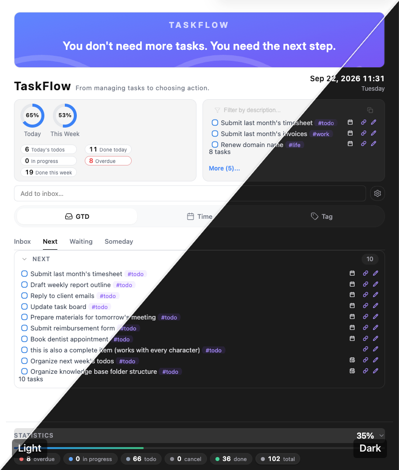

# TaskFlow — Task Management & Action Workspace for Obsidian

<table  border="0" cellspacing="0" cellpadding="0">  
<tr>  
<td valign="top" width="60%">

[English](./README.md) | [中文](./README_ZH.md)

  

> **You don't need more tasks. You need the next step.**

  

**TaskFlow** is a lightweight **Action Workspace** built on top of [Obsidian Tasks](https://github.com/obsidian-tasks-group/obsidian-tasks).

It doesn't change the way you write or query tasks. Instead, it adds a dynamic **Action Space** on top of your existing task lists.

TaskFlow reorganizes your tasks across three dimensions — **Time**, **GTD**, and **Context** — to reduce decision-making friction and help you take action faster.

</td>  
<td width="40%">

</td>  
</tr>  
</table>

### Features and Demonstration

  
  <video src="https://github.com/user-attachments/assets/4787af2c-767d-4d2e-83e2-f6df92633920"  
         width="800"  
         controls  
         loop  
         muted>  
    Your browser does not support video playback  
  </video>  
  
<em>Features and Demonstration of TaskFlow</em>
  

---

## 01｜Why TaskFlow

When it comes to task management in Obsidian, there are two powerful options worth mentioning: **Tasks** and **TaskNotes**. Both are excellent plugins, but they take very different approaches.

> **Note:** Tasks and TaskNotes are both excellent plugins. The comparison below is based entirely on my personal workflow and preferences.

### Tasks

- Tasks is already a powerful task management system.
  - It provides mature task syntax, powerful queries, and reliable rendering with excellent performance. There is no reason to reinvent the wheel.
  - However, Tasks is not designed as a **rich visual frontend**. Its task views and aggregation interfaces are functional, but relatively limited and not highly configurable.

### TaskNotes

- TaskNotes offers a powerful frontend experience.
  - But it comes with a fundamental assumption: **each task is represented by its own dedicated note**. This works extremely well when individual tasks need rich context, notes, properties, and supporting information.
  - But for a simple one-line task, creating an entire note can feel unnecessarily heavy.

I prefer to **keep tasks as simple list items directly inside my notes**.

What I wanted was a powerful and flexible frontend without making the underlying task model heavier.

That is the reason I built **TaskFlow**:

> **Use the powerful task engine of Tasks, and build a simpler, more flexible frontend designed for action.**

### Tasks × TaskNotes × TaskFlow

|                               | **Tasks**                            | **TaskNotes**                                            | **TaskFlow**                                              |
| ----------------------------- | ------------------------------------ | -------------------------------------------------------- | --------------------------------------------------------- |
| **Core role**                 | Powerful task engine                 | Task + notes workspace                                   | **Action-oriented task workspace**                        |
| **Key strength**              | Task syntax, queries, performance    | Powerful task frontend and note integration              | **Lightweight tasks + powerful frontend**                 |
| **Task granularity**          | From one-line tasks to complex tasks | Best suited to tasks that deserve their own notes        | **From one-line tasks to complex tasks**                  |
| **Task syntax**               | **Native**                           | Its own system / integrations                            | **Uses Tasks directly**                                   |
| **Query capabilities**        | **Powerful**                         | Powerful                                                 | **Built on Tasks' query capabilities**                    |
| **Performance foundation**    | **Mature and reliable**              | More feature-rich                                        | **Built on top of Tasks**                                 |
| **Task presentation**         | Relatively basic                     | **Powerful and rich**                                    | **Redesigned for simplicity and efficiency**              |
| **Task aggregation**          | Basic                                | **Powerful**                                             | **Enhanced aggregation and contextual views**             |
| **View philosophy**           | Task querying                        | Task + note management                                   | **Action selection**                                      |
| **Primary use**               | Manage tasks                         | Manage tasks and their content                           | **Find what to do next**                                  |
| **Learning / migration cost** | Existing workflow                    | Requires adapting to a task-as-note model                | **Minimal change to your existing workflow**              |
| **Best for**                  | People who prefer a pure task system | People who want deep integration between tasks and notes | **People who like task lists but want a better frontend** |

---

## 02｜What Problem Does TaskFlow Solve?

### TaskFlow isn't trying to solve "too many tasks." It's trying to solve "too many choices."

**The decision-making that happens before taking action can become a burden in itself.**

Traditional task management primarily solves one problem:

> **Capture things so you don't forget them.**

But when it is time to actually act, there is another problem to solve:

> **Out of all these tasks, which one is actually worth doing right now?**

This creates **action decision cost**.

The more tasks you have, the more complex your context becomes, and the more frequently that context changes, the higher this cost becomes.

TaskFlow is designed to reduce that friction.

Instead of getting stuck at:

> **"What should I do?"**

you can move more quickly to:

> **"I'll do this."**

---

## 03｜What Is TaskFlow?

### TaskFlow is a workspace that moves you from **tasks to action**.

It doesn't ask you to build a new task management system.

Instead, TaskFlow gives you:

> **A different way to look at the tasks you already have.**

Moving from **managing tasks** to **choosing actions**.

|                        | **Traditional Task Management (Task Space)**  | **TaskFlow (Action Space)**                    |
| ---------------------- | --------------------------------------------- | ---------------------------------------------- |
| **Core goal**          | **Manage things** — "so I don't forget"       | **Drive action** — "so I know what to do next" |
| **Focus**              | See all tasks                                 | **Focus on the current action**                |
| **Role of your brain** | **Thinking engine** — "What do I need to do?" | **Execution engine** — "What do I do now?"     |
| **Process**            | Find → Evaluate → Choose                      | **Context → Filter → Act**                     |
| **Outcome**            | Cognitive overload and accumulated stress     | **Remove friction and start immediately**      |

---

## 04｜How Does It Work?

TaskFlow uses information that already exists in your tasks to **narrow down your choices**, placing tasks into different action contexts:

- **GTD → What should I do next?**

  Helps you find the next actionable step from your task list.
- **Time → What should I do today?**

  Helps you identify what actually needs your attention today.
- **Context → What can I do in this situation?**

  Helps you find tasks that fit your current environment, tools, or working context.

As a result:

> **A task is no longer just an item waiting to be completed. It becomes an action that can be rediscovered based on your current context.**

The process changes from:

**Task List → Browse → Evaluate → Compare → Choose**

to:

**Current Context → Narrow the Choices → Find an Action → Start**

In other words:

> **Context → Choice → Action**

---

## 05｜What Do You Get?

TaskFlow ultimately aims to create one simple change:

> **It doesn't help you manage more tasks. It helps you start the next one faster.**

With TaskFlow, you don't just get a better-looking task panel. You get a different way of working with your tasks:

- **No decision paralysis — just start:** Open Obsidian and stop staring at dozens of pending tasks. Quickly identify what is most relevant right now and get started.
- **Zero migration or learning cost:** Fully compatible with your existing Tasks syntax and data. Keep your current workflow and start using TaskFlow immediately.
- **Less willpower, more focus:** Minimize the mental effort spent choosing what to work on, and put your attention where it matters — into actually doing the work.
- **A smoother path into Flow:** By removing friction from the beginning of an action, TaskFlow helps your tasks move naturally and makes it easier for your mind to settle into a focused state.

---

## 06｜Installation

> **TaskFlow is now available in the Obsidian Community Plugins directory.** The recommended way is to install it directly from there; you can also use BRAT or install manually.

---

### Method 1: Install from the Obsidian Community Plugins (Recommended)

1. Open Obsidian → **Settings → Community plugins**
2. Make sure **Safe mode** is turned off.
3. Click **Browse**, then search for `TaskFlow`.
4. Click **Install**, then **Enable**.

> 💡 Installing from the Community Plugins directory gives you automatic updates with each new release.

---

### Method 2: Install via BRAT

[BRAT](https://github.com/TfTHacker/obsidian42-brat) (**Beta Reviewers Auto-update Tool**) is a popular Obsidian community plugin for installing and automatically updating plugins.

Once installed through BRAT, TaskFlow can **automatically follow updates from its GitHub repository**, so you don't need to download new releases manually.

### Steps

1. **Install BRAT**
   - Open Obsidian → Settings → Community plugins → Browse
   - Search for `BRAT`, find **Obsidian42 - BRAT**, then install and enable it.

2. **Add TaskFlow through BRAT**
    
    - Open the BRAT plugin.
    - Click **Add Beta Plugin**.
    - Paste the repository URL:
        `https://github.com/ichris007/taskflow`
    - Click **Add Plugin**. BRAT will automatically download and install the latest version.
        
3. **Enable TaskFlow**
    
    - Go to Settings → Community plugins → Installed plugins.
    - Find **TaskFlow** and enable it.

> 💡 Once installed, BRAT can notify you about new releases and help keep TaskFlow up to date without requiring manual downloads.

---

### Method 3: Manual Installation

If you prefer not to use BRAT, you can download the plugin files directly from GitHub and install them manually.

### Steps

1. **Download the plugin files**
    
    - Open the [Releases](https://github.com/ichris007/taskflow/releases) page.
    - Download the following three files from the latest release:
        
        - `main.js`
        - `manifest.json`
        - `styles.css`
            
    > If there is no release available yet, you can also download these three files directly from the repository root using **Code → Download ZIP**, or open each file individually and save it via **Raw**.
    
2. **Find your Obsidian plugin directory**
    
    - Open your Obsidian vault folder.
    - Go to `.obsidian/plugins/`.
    - If you cannot see the `.obsidian` folder, enable hidden files in your operating system.
        
3. **Create the plugin folder and add the files**
    
    - Create a new folder named `taskflow` inside `plugins`.
    - Put `main.js`, `manifest.json`, and `styles.css` into this folder.
    
    The final structure should look like:
    
    `.obsidian/plugins/taskflow/`  
    ├── `main.js`  
    ├── `manifest.json`  
    └── `styles.css`
    
4. **Enable TaskFlow**
    
    - Restart Obsidian, or press `Ctrl/Cmd + R` to reload it.
    - Go to Settings → Community plugins → Installed plugins.
    - Find **TaskFlow** and enable it.

---

## 07｜Recommended CSS Snippet

I wrote a dedicated CSS snippet to polish the **task list styling** inside TaskFlow.

Some users keep the default Tasks list styling when using TaskFlow, which doesn't quite match the plugin's interface. To make the whole experience more consistent, I put together a set of Tasks CSS styles tuned for TaskFlow, optimizing the task list with:

- **Priority color coding**
- **Compact layout**
- **Single-line fade**
- **Unified icons**
- **Nested task fixes**

If you're using TaskFlow, you can pair it with this snippet to unify the overall look and feel.

> 🔗 CSS snippet: [TaskFlow Task List Enhancements](https://github.com/ichris007/obsidian-share-showcase/blob/main/CSS-snippets/TaskFlow%20Task%20List%20Enhancements.md)

> 💡 To use it, copy the snippet into your vault's `.obsidian/snippets/` folder and enable it in **Settings → Appearance → CSS snippets**.

---

## About the Author

### **猎人科叔** **(Uncle Ke)**

- Technology talent specialist and veteran headhunter with 15 years of experience, focused on Internet, AI, and robotics talent. Conducted 10,000+ interviews.
- Productivity systems practitioner for 16+ years, focused on building efficient systems for work, learning, and personal growth.
- Creator under the name **"猎人科叔"** across social platforms.

For more of Chris's work on Obsidian productivity and knowledge management — including example vaults, plugins, scripts, and practical workflows — visit [Lifein](https://lifein.vip/).

---

## 📄 License

See the `LICENSE` file in the repository.

---

> **TaskFlow — From Task Management to Action.**

