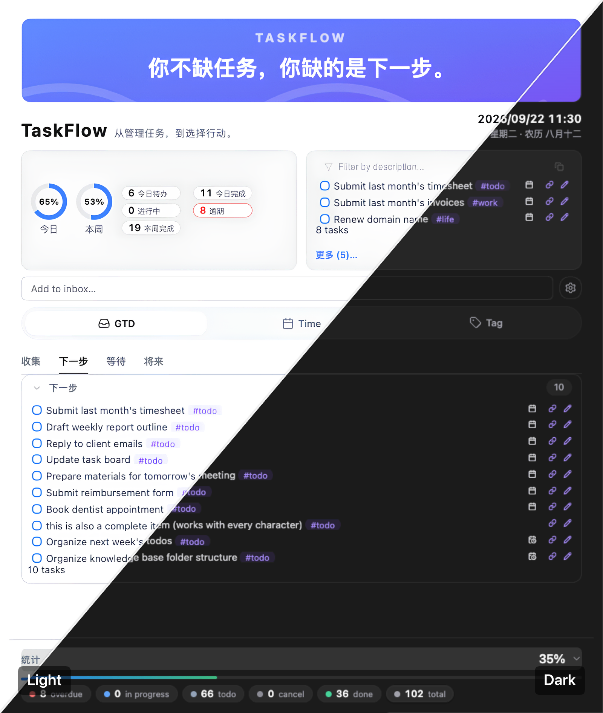

# TaskFlow
[中文](./README.md) | [English](./README_EN.md)

> **你不缺任务。你缺的是下一步。**
>
> *You don't need more tasks. You need the next step.*

**TaskFlow** 是一个面向 [Obsidian Tasks](https://github.com/obsidian-tasks-group/obsidian-tasks) 的**行动工作台**。

它不改变你任何既有的任务记录语法与查询逻辑，而是在任务列表之上，构建了一层动态的 **行动空间（Action Space）**。

它重新组织你的任务，通过**时间**、**GTD** 和**场景**三个维度降低选择成本，让行动更快发生。

---
## 01｜为什么做

我们已经有很多工具帮我们 **记录任务**。

但任务记录得越完整，并不意味着行动就越容易。

当任务越来越多，真正困扰我们的往往不是：

> **「我有没有事情可做？」**

而是：

> **「我现在到底该做什么？」**

打开任务列表，几十个、上百个任务同时出现在眼前。你需要重新判断：

- 哪个更重要？
- 哪个应该先做？
- 今天应该做什么？
- 现在这个时间适合做什么？
- 在当前场景下，我能做什么？

**行动之前的选择，本身就成了一种负担。**

TaskFlow 就是从这里开始的。

---

## 02｜解决什么

### TaskFlow 解决的不是「任务太多」，而是「选择太难」。

传统任务管理主要解决：

> **把事情记下来，避免遗忘。**

但真正到了行动时，我们还需要解决另一个问题：

> **从这么多事情里，找到此刻值得做的那一件。**

这是一种 **行动决策成本**。任务越多、场景越复杂、上下文越频繁变化，这种成本就越高。

TaskFlow 希望减少的，正是这一步：

> **少一点寻找，少一点比较，少一点犹豫。**

让你从：

> **「我该做什么？」**

更快进入：

> **「那就做这个。」**

---

## 03｜是什么

### TaskFlow 是一个从「任务」走向「行动」的工作台。

它不是让你建立一套新的任务系统，TaskFlow 做的是：

> **让你换一个角度重新审视这些任务。**

传统任务管理关注：

> **我有哪些任务？**

TaskFlow 关注：

> **基于我现在的情况，我能做什么？**

因此，它不是单纯的 **任务空间（Task Space）**，而是尝试建立一个 **行动空间（Action Space）**。

从 **管理任务** 走向 **选择行动**。

| 维度 | 传统任务管理（任务空间） | TaskFlow（行动空间） |
| --- | --- | --- |
| **核心目标** | **管理事情**（怕忘了） | **推动行动**（不知道先做啥） |
| **关注焦点** | 看见所有任务（Task） | 聚焦当前行动（Action） |
| **大脑角色** | **思考引擎**（我有什么要做？） | **执行引擎**（我现在做什么？） |
| **操作过程** | 找任务 → 判断 → 选择 | 场景 → 筛选 → 行动 |
| **最终结果** | 认知过载，积累焦虑 | **消灭阻力，即刻开始** |

---

## 04｜怎么解决

TaskFlow 不试图替你决定人生中最重要的事情。它做的是利用任务本身已经存在的信息，帮助你 **缩小选择范围**，把任务放回不同的行动上下文中：

- **GTD → 下一步该做什么？**  
  帮助你从任务链中找到可以继续推进的下一步。

- **Time → 今天该做什么？**  
  帮助你从时间维度找到今天真正需要面对的事情。

- **Tag → 在这个场景下该做什么？**  
  帮助你根据当前的工作环境、工具或场景，找到此刻适合做的事情。

于是：

> **任务不再只是一个等待完成的列表项，而成为一个可以根据上下文被重新发现的行动。**

整个过程从：

**任务列表 → 浏览 → 判断 → 比较 → 选择**

变成：

**当前上下文 → 缩小范围 → 找到行动 → 开始**

也就是：

> **Context → Choice → Action**

---

## 05｜你得到什么

最终得到的不是一个更复杂的任务系统，而是一个更轻的行动入口。

你不需要每次面对几十个任务，重新思考：

> 「我现在干什么？」

而是更快得到一个清晰的答案：

> **「现在，我可以做这个。」**

于是：

**更少的选择** → **更低的决策成本** → **更少的行动摩擦** → **更快开始** → **更容易进入持续行动的状态**

TaskFlow 最终想带来的改变，可以浓缩成一句话：

> **不是帮你管理更多任务，而是帮你更快开始下一件事。**

当你使用 TaskFlow 时，你收获的不只是一个好看的面板，而是整套工作流的质变：

- **零决策瘫痪，即刻启动**：打开 Obsidian 的瞬间，不再面对几十条待办发呆，一眼锁定当前最值得做的事。
- **零迁移与学习成本**：完全兼容现有的 Tasks 语法与数据，不改变记录习惯，即装即用。
- **意志力解脱，专注执行**：把「挑选任务」的消耗降至最低，将宝贵的注意力全额注入到真正的「行动」中。
- **自然进入心流（Flow）**：用结构化的 TaskFlow 消除行动阻力，让任务顺畅流转，让大脑轻松滑入专注的心流状态。

---

## 06｜核心叙事

> **任务越来越多 → 选择越来越难 → 行动成本越来越高 → TaskFlow 把「选择什么」这件事变简单 → 让人更快进入行动。**

> 任务可以有上百个，但此时此刻的「下一步」，只需要一个。
>
> **TaskFlow：从管理任务，到选择行动。**

---

## 07｜安装指南

### 插件展示

> **TaskFlow 目前尚未上架 Obsidian 社区插件中心**，你需要通过以下两种方式之一手动安装。

---

### 方式一：通过 BRAT 插件安装（推荐）

[BRAT](https://github.com/TfTHacker/obsidian42-brat)（Beta Reviewers Auto-update Tool）是 Obsidian 社区中用于安装和自动更新未上架插件的常用工具。使用 BRAT 安装后，插件可以**自动跟随 GitHub 仓库更新**，无需每次手动下载。

### 步骤

1. **安装 BRAT 插件**
    - 打开 Obsidian → 设置 → 第三方插件 → 浏览
    - 搜索 `BRAT`，找到 **Obsidian42 - BRAT**，点击安装并启用

2. **通过 BRAT 添加 TaskFlow**
    - 打开 BRAT 插件
    - 点击 **Add Beta Plugin**
    - 在输入框中粘贴仓库地址：
        `https://github.com/ichris007/obsidian-taskflow`
    - 点击 **Add Plugin**，BRAT 会自动下载并安装最新版本
        
3. **启用插件**
    - 回到 设置 → 第三方插件 → 已安装插件
    - 找到 **TaskFlow**，打开开关即可使用

> 💡 之后每当仓库有新版本发布，BRAT 会自动提示或帮你更新，无需手动操作。

---

### 方式二：手动安装

如果你不想使用 BRAT，也可以直接从 GitHub 下载文件手动放入插件目录。

### 步骤

1. **下载插件文件**
    - 打开仓库 Releases 页面：  
        [https://github.com/ichris007/obsidian-taskflow/releases](https://github.com/ichris007/obsidian-taskflow/releases)
    - 下载最新版本中的以下三个文件：
        - `main.js`
        - `manifest.json`
        - `styles.css`
    
    > 如果 Releases 页面暂无发布版本，也可以在仓库根目录中直接下载这三个文件（通过 Code → Download ZIP，或逐个文件打开后点 Raw 保存）。
    
1. **找到你的 Obsidian 插件目录**
    - 打开你的 Obsidian 库（Vault）文件夹
    - 进入 `.obsidian/plugins/` 目录  
        （如果看不到 `.obsidian` 文件夹，需要在系统设置中开启「显示隐藏文件」）
        
2. **创建插件文件夹并放入文件**
    - 在 `plugins` 目录下新建一个文件夹，命名为：`taskflow`
    - 将下载的 `main.js`、`manifest.json`、`styles.css` 放入该文件夹
    - 最终结构应为：
        .obsidian/plugins/taskflow/
        ├── main.js
        ├── manifest.json
        └── styles.css
        
3. **启用插件**
    - 重启 Obsidian（或按 `Ctrl/Cmd + R` 重新加载）
    - 打开 设置 → 第三方插件 → 已安装插件
    - 找到 **TaskFlow**，打开开关

---

## 关于作者

**猎人科叔**

- 科技行业人才专家，15 年老猎头，互联网 / AI / 机器人，面试超万人。
- 生产力系统专家，专注 16 年+，打造高效工作和成长体系。
- 自媒体全网同名：**猎人科叔**。

更多关于科叔的 Obsidian 生产力与知识管理实践（示例库、插件、脚本、经验等），见 <https://lifein.vip>。

---

## 📄 License

请参见仓库中的 LICENSE 文件。

---

> **TaskFlow — 从任务管理，到行动。**
